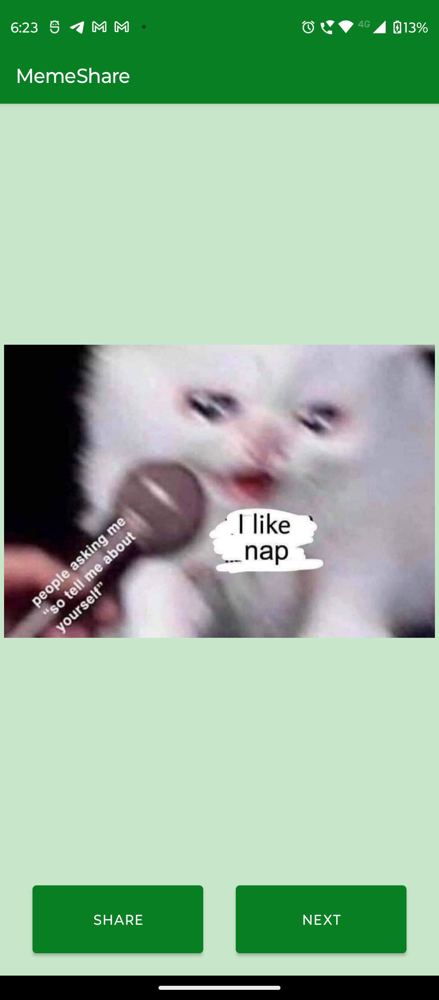
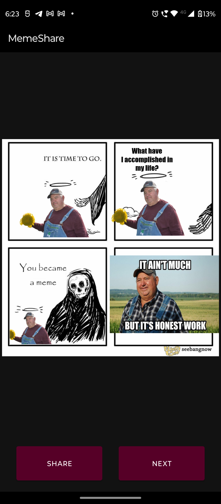

# MemeShare

MemeShare Android is a mobile application that allows users to browse and share memes from the internet using the Meme API.

## Features

- Browse a vast collection of hilarious memes from the web
- Share your favorite memes with friends through various social media platforms
- Get the latest trending memes in real-time

## Screenshots

  
  

## Installation

1. Clone the repository: `git clone https://github.com/Ankitsh-rtx/MemeShare.git`
2. Open the project in Android Studio.
3. Build and run the project on an Android emulator or device.

## Dependencies

- Retrofit - HTTP client for API communication
- Glide - Image loading and caching library
- Gson - JSON serialization/deserialization library
- Material Design - UI components and guidelines

## Contributing

Contributions are welcome! If you find any issues or have suggestions for improvement, please open an issue or submit a pull request.

## License

This project is licensed under the MIT License - see the [LICENSE](LICENSE) file for details.

